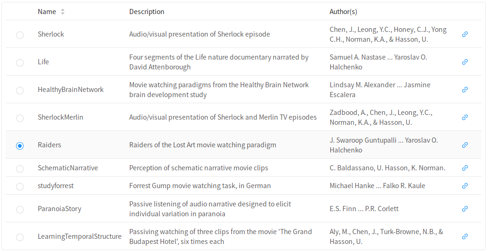

# Getting Started

## Sign up

First things first, you need to register for an account on [neuroscout.org](https://www.neuroscout.org).

Currently, there are two supported options—the choice is yours!

- Create an account using an email address and password (old fashioned way).
- Use Google single sign on.

If you create an account with us, you'll be asked to validate your email, as usual.

```{admonition} Note
Accounts are linked using email addresses. Signing up twice using the same email address, will result in a single account.
```

```{warning} 
Note that Google accounts are currently not supported by the `Neuroscout API` wrapper [pyNS](https://github.com/neuroscout/pyNS). To interact with the `API` using `pyNS`, create an account using email and password.
```

Once you've logged in, launch the [analysis builder](builder.md) using the `New Analysis` navigation button.


## Overview

In the analysis builder, you'll sequentially advance through tabs as you define your analysis.
Later in the process, you can always go back to tabs that you've previously encountered and make modifications.

In the `Overview` tab, the first step is to give your analysis a `name`. This doesn't have to be a unique name (although that might be helpful), and you can always change it later.

Optionally, also give your analysis a `description`. If you make many analyses, this could be very helpful.

### Choosing a dataset



`Neuroscout` currently indexes a curated set of [16 public naturalistic fMRI datasets](https://neuroscout.org/datasets).

Datasets were specifically chosen for their compliance to the [BIDS standard](https://bids.neuroimaging.io/), and availability of original naturalistic stimuli.
You can find detailed information on each dataset by clicking on the `blue link`.

All datasets are minimally preprocessed using [fmriprep](https://fmriprep.org/en/stable/) [1.2.2 or greater](https://fmriprep.org/en/stable/changes.html), and ready for model fitting.

If you have a dataset you'd like to contribute, see this [frequently asked question](../faq.md#i-have-a-naturalistic-study-id-like-to-share-on-neuroscout-how-do-i-do-so).

### Selecting task and runs

Once you've selected a `dataset`, you'll be able to choose which `task` and `runs` you want to analyze.

Currently, we only support analyzing one `task` at a time. By default, all `runs` for that `task` are selected.

If you want to select specific `run`s to analyze, either to only analyze a subset of `subjects`, or to omit certain `run`s that might have a known issue, you can use the `run selector interface`.


Here you can browse and select specific `run`s.
If you'd like to select groups of runs based on their `BIDS` entities (e.g. `Subject`, `Run Number`, etc..), click on the filter icon at the top of each column. A drop down menu will appear, allowing you to make a selection. Click "OK" to apply this filter.

You can clear all filters and select all `run`s by clicking `Clear Filters` on the bottom left.

### Saving and unique ID

To save your nascent analysis, click on the "Save" button. If the button is blue, that means there are unsaved changes.


When you first save your analysis, it will be assigned a unique, permanent `ID`.

Note that when you advance through tabs in the builder, the analysis will be automatically saved.

Click on the `Next` button to advance to the `Predictors` selection tab.
