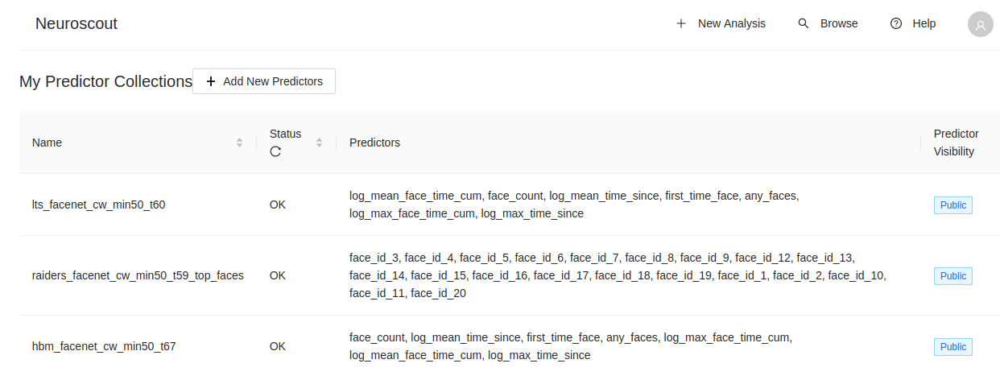

# Uploading Predictors

```{admonition} Note
You can browse all predictors currently available on Neuroscout [here](https://neuroscout.org/predictors).
```

The majority of predictors on Neuroscout are automatically extracted from experimental stimuli in a centralized manner using [pliers](https://pliers.readthedocs.io/en/latest/). However, you may have your own predictors that you would like to include in your model that have not yet been extracted, or were obtained from a different source (e.g. manual annotation). In this case, you can upload your own predictors to Neuroscout, or contribute a new extractor to pliers, and have your predictors automatically extracted.

## Uploading using the Web Interface

The easiest way to upload custom predictors is using the web interface. Hover over your profile picture in the top right, and click on "My Predictors", or navigate to [https://neuroscout.org/mycollections](https://neuroscout.org/mycollections).




In this page, you can upload custom collections of predictors, and browse the resulting Predictor Collections that you have uploaded.

To upload a new Predictor Collection, click on the "Add New Predictors" button. 

First, you will be asked to select a Dataset to associate the predictors with. Next, you will be asked to give a name to your collection, and upload a file containing your predictors.

### Data Format

Features should be in BIDS-like events format. Two columns are mandatory: “onset” and “duration” (both in seconds). You can then include any number of predictors as additional columns. Missing values can be (optionally) annotated using the value “n/a” (no quotes). Missing values can be useful in cases where a value was attempted to be extracted, but failed. For example, if a transcript word was not found in the dictionary, you could annotate this as missing value. You may also use it if you are including multuple predictors with distinct timing. Otherwise, if there is no value to extract (e.g. a video frame does not contain a face), you can simply omit the row for that onset. 

### Example

|   onset |   duration | word_frequency   |   word_length  |   face_valence  |
|--------:|-----------:|:-----------------|---------------:|----------------:|
|       1 |        0.2 | 0.1              |             10 |             n/a |
|      10 |        2.1 | n/a              |            n/a |               1 |
|      14 |        0.3 | 0.8              |              5 |             n/a |
|      30 |        5   | n/a              |            n/a |               2 |
|      50 |        3   | 0.3              |              3 |             n/a |
|      60 |        3.1 | n/a              |              2 |             n/a |

In this example, there are three predictors: `word_frequency`, `word_length`, and `faces_present`. In the last row, a value could not be extracted for `word_frequency` (even though a word was presented, as evidenced by the column "word_length"), and thus it is encoded as "n/a". Similarly, for "face_valence", values were only given for the onsets where a face was present.

For each events file that you upload, you will be asked to associate it with runs in the respective dataset. Note that in naturalistic experiments, it is commmon to display a long movie stimuli across multiple runs. In this case, events must be split up by run, and each run must be associated with a unique events file.
Also, note that in many cases, the same stimulus may be presented to multiple subjects. In this case, you will associate a given event file with multiple subjects.

For example, given a dataset where all subjects saw the same movie, split across 5 runs, you would upload a total of 8 event files, each associated with the single run. If you had 10 subjects, you would then associate each of these 8 event files with all 10 subjects.


After uploading, a new collection of predictors will be created. By default, predictors in this collection will be private, and only visible to you in the Analysis Builder. If you wish to share these predictors with other Neuroscout users, please contact us, and we can make your predictors public.

## Contributing Extractors to Pliers

Alternatively, if you have a new extractor that you would like to contribute to pliers, that you believe would be useful to the community, please see the [pliers documentation](https://pliers.readthedocs.io/en/latest/). We are happy to help you get started, and can provide guidance on how to best implement your extractor.
If the extract is likely to have general appeal, it is possible we could centrally extract it across all datasets, and make it available to all users. This also applies to extractors that may already be implemented in Pliers, but not yet extracted. Please get in touch!

Please see the [Get Involved](overview/get_involved.md) page for more information on how to contribute to Neuroscout.

